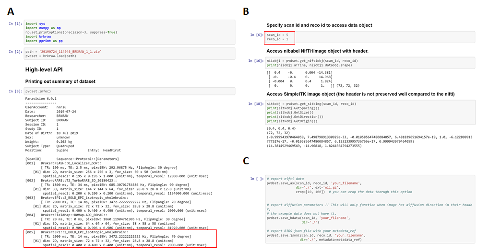

## Python API


- import module
```js
>>> import brkraw as br
```

- load dataset
```js
>>> rawdata = br.load(<PATH>)
```

- If you want to learn more detail about Python API, please check our example
[Jupyter Notebooks](https://mybinder.org/v2/gh/BrkRaw/tutorials/ac95b2c87b05664cb678c5dc1a930641397130ed).
