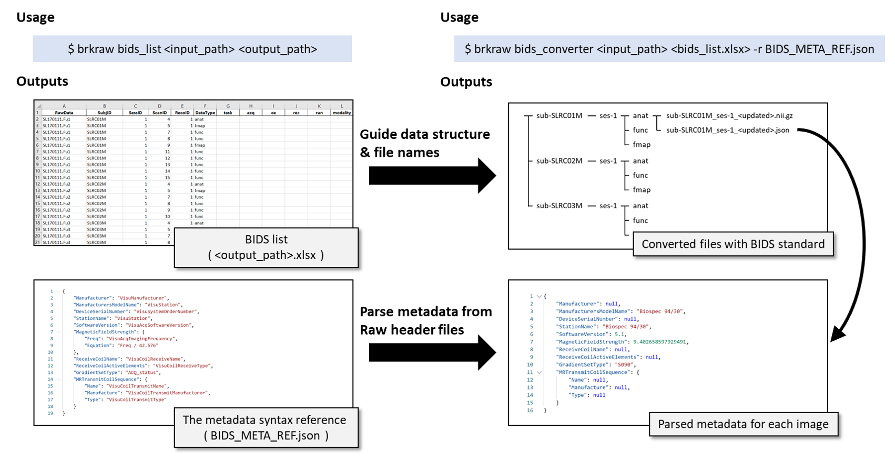

# BIDS converter

**The usage of the command-line tool 'brkraw' for BIDS data organization.**

- Upgraded feature to reduce the burden on renaming according to BIDS standard.
- Create a BIDS file table with excel format to use as a template for updating metadata 
that required to use for file naming.
- This command will also generate the <output filename>.json which allows you to set 
custom JSON syntax to parse the metadata from the raw Bruker data according to the BIDS v1.2.2.
- To learn more detail regarding the JSON syntax, please check our example
[Jupyter Notebooks](https://github.com/brkraw/bruker/blob/master/examples/BrkRaw_PythonAPI.ipynb).
- The bids_converter command will generate empty template of `dataset_description.json` and `README`


```js
$ brkraw bids_helper <input dir> <output filename> [-j]
```

- Build BIDS dataset according to the excel file generated with 'bids_helper' command above.

```js
$ brkraw bids_convert <input dir> <BIDS datasheet.xlsx> [-r <JSON syntax template.json>] [-o <output dir>]
```
