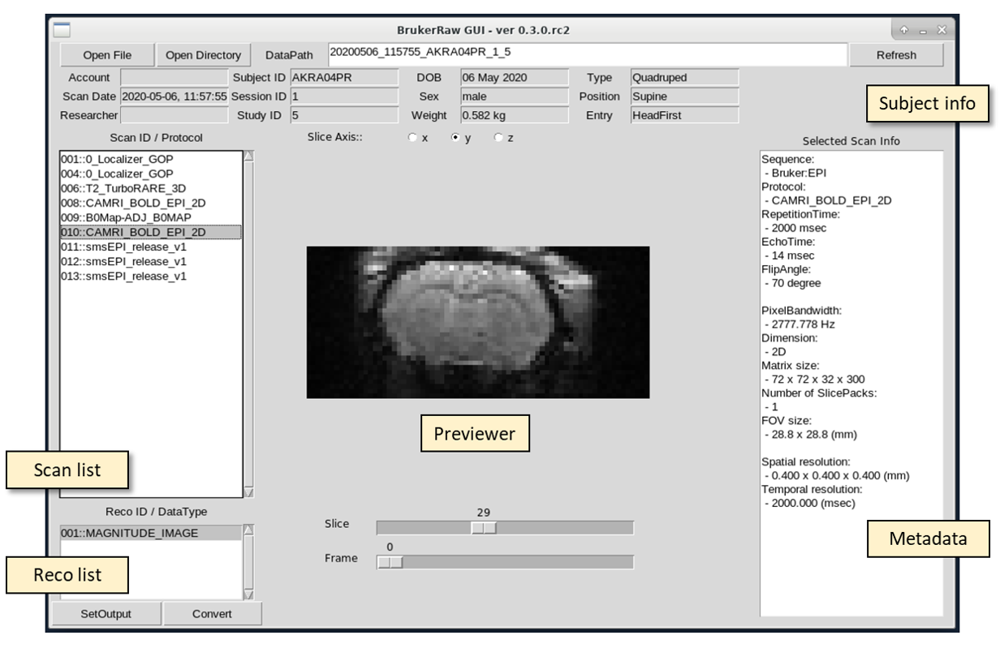

# Graphical User Interface (GUI)

- Run GUI with input and output path
```js
$ brkraw gui -i <session path> -o <output path>
```


**brkraw gui interface.**

- You can run GUI without any path option. It will show you only two buttons (Open File / Open Directory). 
In case you are opening zipped PVdataset, please use 'Open File' button. For later case, 
Make sure you are entered to the PVdataset root folder where the subject file located.
If you does not enter to the dataset folder, the GUI will freeze. This case, just force quit the GUI.

```js
$ brkraw gui
```