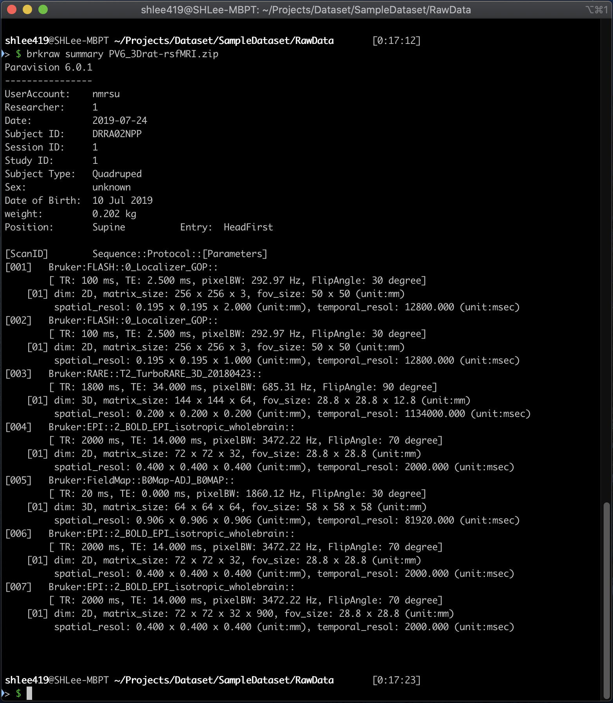
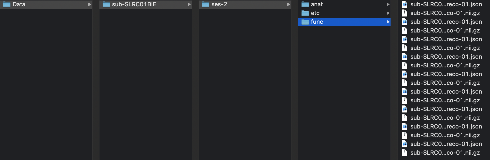

# converting NifTi (Legacy)
{: .no_toc}

## Table of contents
{: .no_toc .text-delta}
1. TOC 
{:toc}
---

## Quick access of metadata
- Printing out dataset information

```js
$ brkraw info <input raw data>
```

**Example of printed out dataset information**

## **brkraw** command-line tool
- This method has been inherited from old brk2nii and [PyBruker](https://pypi.org/project/pyBruker) which 
has been removed from repository and is not existing anymore. This function is useful if you want to convert 
whole dataset without need to considering data structure, or only needs to convert specific scan and reco.

### **tonii**: Convert single scan to NifTi
```js
$ brkraw tonii <input raw data> [-s <scan id>] [-r <reco id>]
```

### **tonii_all**: Convert whole study to NifTi
- Convert a whole session, (adding option '-b' or '--bids' will generate JSON file that contains MR parameters 
based-on BIDS standard)

```js
$ brkraw tonii <input raw data>
```


- Build BIDS dataset with multiple Bruker raw datasets.
- You need to copy all data into one parent folder, compressed zip file will also work (we recommend to use zip file)
- All dataset under parent folder will be converted into ./Data folder with BIDS structure, but filename will not follow
the BIDS standard. If you need to share your data, we recommend to use bids_converter function instead.


**Example of automatically generated BIDS dataset**

```js
$ brkraw tonii_all <input dir>
```
