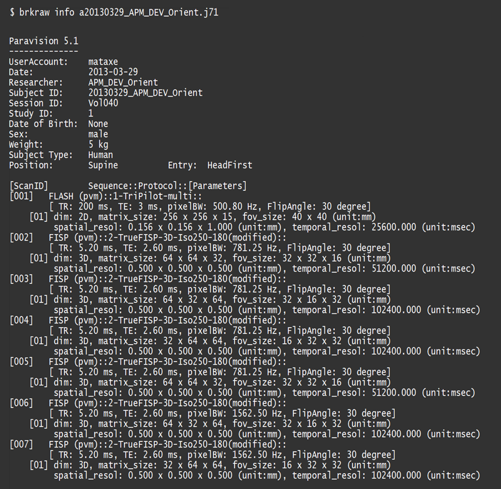

# converting NifTi (Legacy)
{: .no_toc}

## Table of contents
{: .no_toc .text-delta}
1. TOC 
{:toc}
---

## Quick access of metadata
- Printing out dataset information

```js
$ brkraw info <input raw data>
```

**Example of printed out dataset information**

## **brkraw** command-line tool
### Common features for all conversion
- If the data is aquired with DWI sequence, the bvals and bvecs will automatically generated.
- In this case you want to ignore data rescale and use the '--ignore-rescale' option.

### **tonii**: Convert single scan to NifTi
- This method has been inherited from old brk2nii and [PyBruker](https://pypi.org/project/pyBruker) which 
has been removed from repository and archived. This function is useful if you want to convert 
whole datasets without needing to consider data structure or converting specific Scan and Reco IDs.
- If you want to convert a specific Scan, provide the option '--scanid' with corresponding Scan ID.  
- If a Scan has multiple Reco images, provide '--recoid' with corresponding Reco ID. 
Without this option, the default Reco ID would be 1.

```js
$ brkraw tonii <input raw data> [-s <scan id>] [-r <reco id>]
```

- Without the --scanid (-s), all scan images in the raw data will be converted.

```js
$ brkraw tonii <input raw data>
```

### **tonii_all**: Convert whole study to NifTi
- The function to convert multiple raw dataset.
- You must provide the parent folder where more than one raw data is existing.
- By adding option '-b' or '--bids', it will generate JSON file that contains META parameters.
- All dataset under parent folder will be converted into ./Data folder with BIDS structure, but filename will not follow
the BIDS standard. If you need to share your data, we recommend to use bids_convert function instead.

```js
$ brkraw tonii_all <input dir>
```
